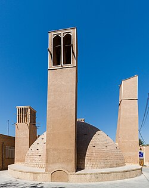
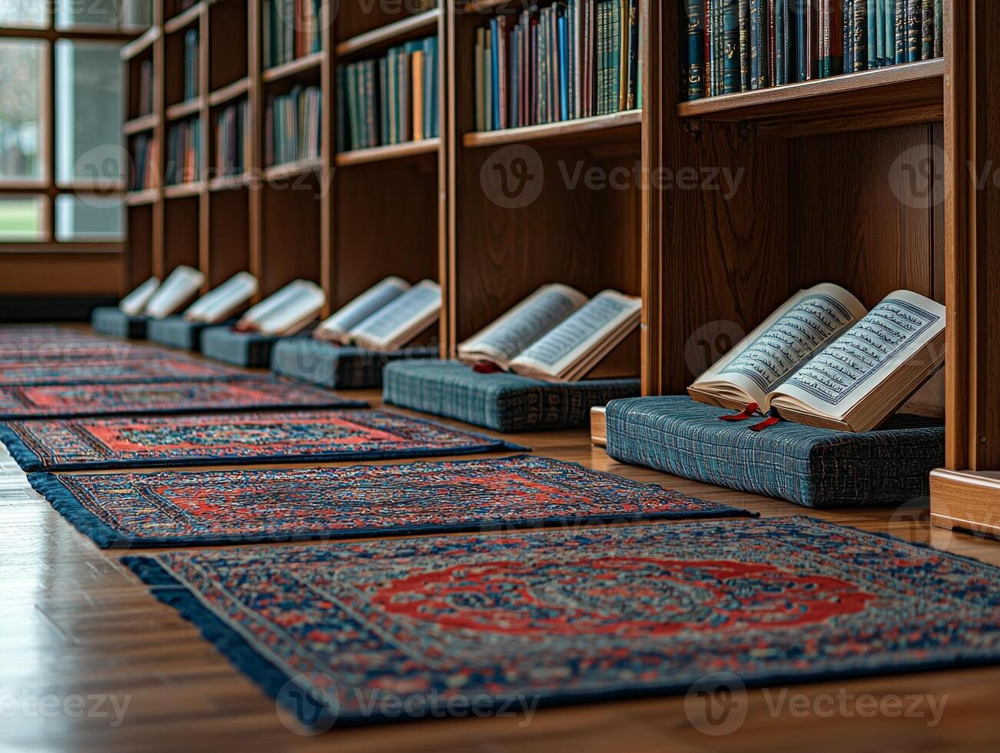

<!DOCTYPE html>
<html lang="en">
<head>
    <meta charset="UTF-8">
    <meta name="viewport" content="width=device-width, initial-scale=1.0">
    <title>Mosque Explorer Mission</title>
    
</head>
<body>

    

        <h1>Mosque Explorer Mission</h1>
        

        

    

    

        <h1>The Community Heart</h1>
        

        

    

    

        <h1>Ancient Roots</h1>
        

        

    

    

        <h1>Built to Last</h1>
        

        

    

    

        <h1>The Art of Focus</h1>
        

        

    

    

        <h1>Geometry Secrets</h1>
        

        

    

    

        <h1>Science of Sound</h1>
        

        

    

    

        <h1>Natural Cooling</h1>
        

        

    

    

        <h1>Equality for All</h1>
        

        

    

    

        <h1>Live Scavenger Hunt</h1>
        

            
Mission Success! You are now an expert. When we visit the Mosque, find these 4 secrets:

            

                
🔍 The Prayer Arch

                
🔍 8-Pointed Stars

                
🔍 Washing Fountains

                
🔍 The Dome Echo

            

        

        <button class="restart-btn" onclick="location.reload()">RESTART MISSION</button>
    

</body>
</html>
